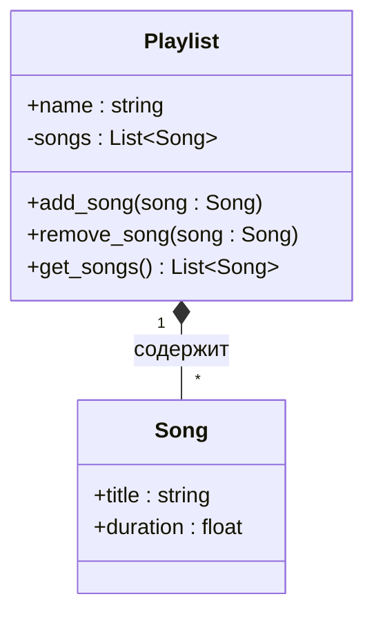
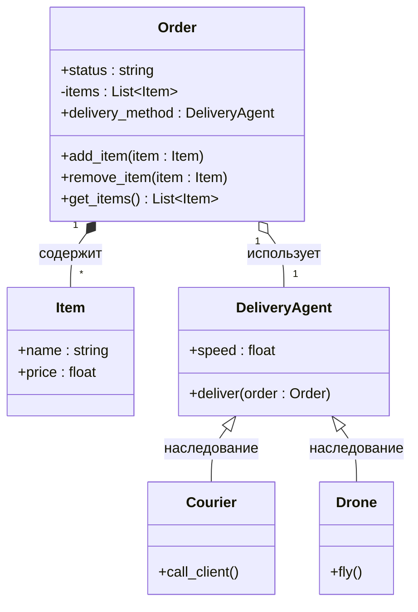
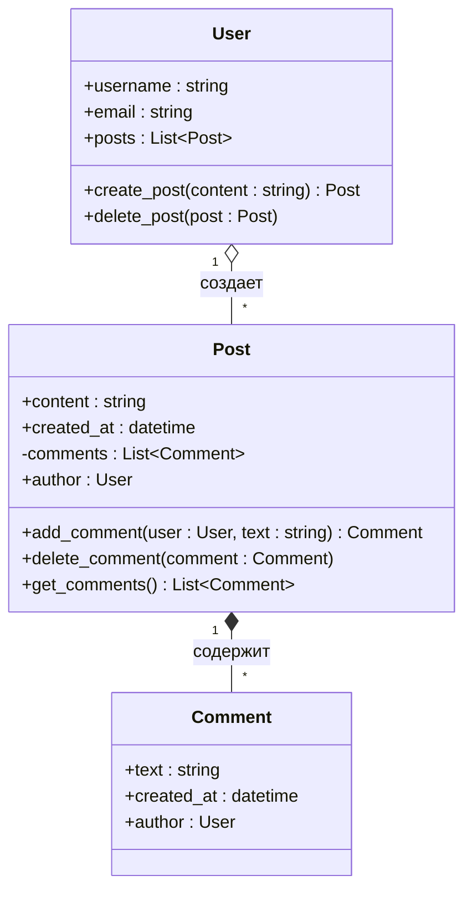

Задание 1
 ```mermaid
classDiagram
    class SmartLight {
    +int brightness
    +String color
    -bool is_on
    +turn_on()
    +turn_off()
    +set_color(new_color String)
    }
```
Задание 2
 ```mermaid
classDiagram
    class CreditCard { 
    +String owner_name
    #float balance
    -String number
    -String cvc
    -int pin()
    +pay(float amount) bool
    -chech_pin(int input_pin) bool
    }
   ```

Задание 3
 ```mermaid
classDiagram
    class Character {
        +name : string
        +move()
    }
    
    class Archer {
        +shoot()
    }
    
    class Knight {
        +attack_sword()
    }
    
    Character <|-- Archer : наследование
    Character <|-- Knight : наследование
```
Задание 4

Задание 5

Задание 6
